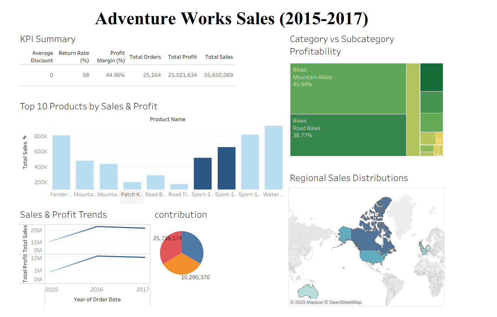

1️⃣ 📊 Adventure Works Sales Analysis Dashboard (2015–2017) – Tableau

  <b>Tableau Dashboard for Sales, Profit & Regional Performance Analysis</b> 
  Revenue • Profit • Products • Categories • Geography

---

2️⃣ 🚀 Project Overview
This project presents an **interactive Tableau Sales Analytics Dashboard** built using the **Adventure Works dataset**, covering the period **2015–2017**.

The dashboard is designed to help business users and analysts:
- Track overall sales & profit
- Identify high-performing products and categories
- Analyze profitability at category & subcategory level
- Understand regional sales distribution
- Observe year-wise sales and profit trends

---

3️⃣ 🧠 Business Questions Answered
1. What are the **total sales and profit figures** across years?
2. Which **categories and subcategories drive maximum profitability**?
3. What are the **top 10 products by sales and profit**?
4. How do **sales and profit trends change year over year**?
5. Which **regions contribute most to total sales**?

---

4️⃣ 📌 KPI Summary
| KPI | Value |
|----|------|
| 💰 Total Sales | **55,650,069** |
| 📈 Total Profit | **25,021,634** |
| 🛒 Total Orders | **25,164** |
| 📉 Profit Margin | **44.96%** |
| 🔄 Return Rate | **58%** |
| 🎯 Average Discount | **0** |

---

5️⃣ 📈 Key Insights (Senior Analyst Perspective)

5.1 🔹 Sales & Profit Trends  
- Strong growth from **2015 to 2016**.
- Slight stabilization in **2017**, indicating market maturity.

5.2 🔹 Category vs Subcategory Profitability  
- **Bikes** category dominates profitability.
- **Mountain Bikes (45.94%)** and **Road Bikes (38.77%)** are the top profit contributors.

5.3 🔹 Top Products Performance  
- Top 10 products contribute a significant portion of overall sales.
- Clear **Pareto effect (80/20 rule)** observed.

5.4 🔹 Regional Sales Distribution  
- **North America** leads in total sales.
- Europe and Australia show steady contributions.
- Useful for regional expansion and marketing decisions.

5.5 🔹 Contribution Analysis  
- Revenue contribution is uneven across categories.
- Helps prioritize high-impact business segments.

---

6️⃣ 🌐 Tableau Public Dashboard (Live)
🔗 **View Interactive Dashboard on Tableau Public**  
👉 https://public.tableau.com/app/profile/praveen.tiwari4211/viz/ADVsalesTableau/Dashboard2?publish=yes

---

7️⃣ 🖥 Dashboard Preview
🔗 **Tableau Dashboard Screenshot**

---

8️⃣ 🛠 Tools & Technologies Used
- **Tableau Desktop & Tableau Public** – Interactive dashboards & storytelling
- **Microsoft Excel** – Data preparation & cleaning
- **Calculated Fields** – KPIs and profitability metrics
- **Sales Analytics Concepts** – Revenue, margin, contribution, regional analysis

---

1️⃣1️⃣ 🎯 Business Impact
This dashboard helps organizations to:
- Identify top-performing product categories
- Understand profitability drivers
- Analyze regional sales patterns
- Support data-driven sales strategy
- Communicate insights clearly to stakeholders

---

1️⃣2️⃣ 👤 Author
**Praveen Tiwari**  
Aspiring Data Analyst | Tableau | Power BI | Excel | Analytics  
